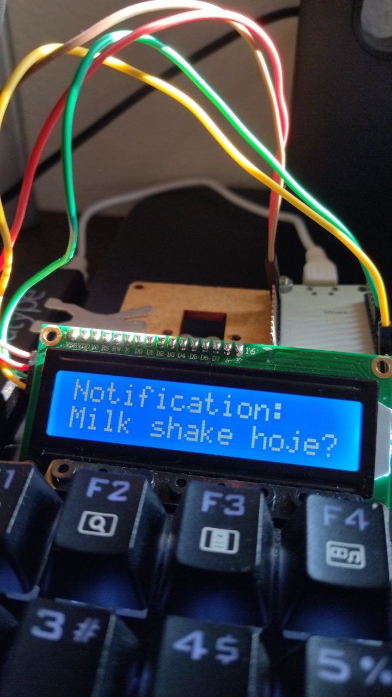
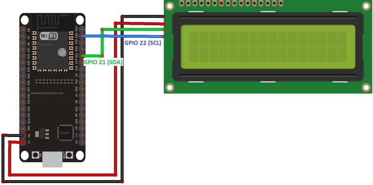

# lcd-notifications

## Endpoints

| Endpoint | Função |
|---|---|
| `"/"` | Health check |
| `"/post"` | Recebe um `POST` contendo a notificação via arg (`?notification=foo`) |

## Pinagem

| I2C LCD | ESP32 |
|---|---|
| GND | GND |
| VCC | VIN |
| SDA | GPIO21 |
| SCL | GPIO22 |

